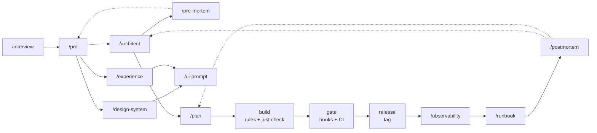

# claude-rules

A shared library of **coding-agent assets** — rules, skills, subagents and a
quality-gate kit — built across projects and installed into any repo the way
shadcn installs components: **copy, own, pin**. No runtime dependency, no
submodule to babysit.

**Agent-agnostic** (despite the name): Claude Code is the canonical authoring
format, and the installer emits/transforms each asset for **Cursor, Codex and
opencode** too (`--agent`). See [Multi-agent targets](#multi-agent-targets).

Installing profiles does not just drop files — it installs a **way of working**.
That workflow is implicit in the assets, so it is spelled out first.

---

## The workflow these assets encode



| Phase | Command | Produces | Who decides |
|---|---|---|---|
| **Frame** | `/interview` → `/prd` | `docs/PRD.md` (+ `docs/prd/` once it grows) | human, question by question |
| **Decide** | `/architect` | `docs/ARCHITECTURE.md` + one ADR per decision | agent writes `Proposed`, **human accepts** |
| **Attack it** | `/pre-mortem` | `docs/premortem/<target>-<horizon>.md`, deltas back into PRD/ADRs | human, on each mitigation |
| **Design the surfaces** | `/design-system`, `/experience` → `/ui-prompt` | `docs/DESIGN.md`, `docs/EXPERIENCE.md`, a generator prompt | human |
| **Slice** | `/plan` | `docs/PLAN.md` (+ `docs/plan/` once it grows) | human validates the granularity |
| **Build** | (no command — rules auto-load) | code + tests, `just check` green | **the gate**, not an opinion |
| **Gate** | `/ci-setup` | the pipeline, calling the same `just` recipes | human sets branch protection |
| **Ship** | — | a tag | **human pushes the tag** |
| **Run** | `/observability` | `docs/OBSERVABILITY.md`, SLOs as ADRs, the alert table | human agrees the error budget policy |
| **Survive** | `/runbook`, `/postmortem` | `docs/runbook/*`, `docs/postmortem/*` | human owns each action item |

Nothing forces you through all of it. A library repo installs `rust testing cicd`
and never runs a product skill; a greenfield product starts at `/interview`.

### Two boundaries the whole library is built around

1. **The machine settles correctness.** An agent writes the code *and* its tests,
   runs `just check`, reads the failure, fixes the cause, and only then hands back.
   A green gate is permission; the agent's belief is not (`rules/agent/autonomy.md`).
2. **A human settles decisions.** A green gate is permission for *code*, never for a
   *decision*. Four things an agent proposes and never takes: an **ADR's status**
   (enforced by `adr-check`), the **release tag**, the **error budget policy**, and
   any **acceptance** of scope. Discussing is not accepting.

### Documents grow as units, not as longer files

A PRD and a plan are meant to grow; the *file* is not. Past a threshold each becomes
a directory of append-only units plus a one-screen index — the shape `docs/adr/`
already has (`rules/product/documents.md`, enforced advisorily by `docs-check`). The
thresholds are defaults: a repo moves them in `.docs-budgets.json` at its root, a file
the installer never writes — so an update cannot reset a budget you argued for.

```
docs/
├── PRD.md              # the stable spine + the capability table   (index)
│   └── prd/            # one capability per file                   (units)
├── ARCHITECTURE.md     # stack + boundaries + the decision log     (index)
│   └── adr/            # one decision per file, ~400 words         (units)
├── PLAN.md             # where we are + the phase table            (index)
│   └── plan/           # one phase per file, frozen once shipped   (units)
├── DESIGN.md           EXPERIENCE.md          # visual / behavioral systems
├── OBSERVABILITY.md    # SLIs, SLOs, gaps, alert table             (index)
├── runbook/            # one per failure mode, one screen
├── postmortem/         # one per incident, blameless
└── premortem/          # one register per (target, horizon)
```

---

## Install

```bash
# in your repo, from its root — combine profiles freely:
npx github:dohrm/claude-rules add rust testing cicd hexagonal api backend   # a Rust backend
npx github:dohrm/claude-rules add ts testing cicd portal-flat               # a React frontend
npx github:dohrm/claude-rules add ops k8s incident                          # + running it in production
npx github:dohrm/claude-rules add product                                   # the product-lifecycle skills

npx github:dohrm/claude-rules list                     # available & installed
npx github:dohrm/claude-rules init                     # assemble justfile + lefthook.yml from the kit
npx github:dohrm/claude-rules add rust --ref v0.1.0    # pin a ref (default: main)
npx github:dohrm/claude-rules add rust --agent claude  # narrow the target agents (default: ALL)
npx github:dohrm/claude-rules update --ref v0.2.0      # replay the locked profiles+agents at a new ref
npx github:dohrm/claude-rules remove cqrs              # delete a profile's files, update the lock
npx github:dohrm/claude-rules remove all               # full uninstall
```

**Not sure which profiles?** That gating is owned by `/architect`, which maps your
shape (backend / frontend / fullstack / gamedev) to a profile set and prints the
exact command. Install `product` first, or read the table in
[`skills/architect/SKILL.md`](./skills/architect/SKILL.md).

### The profile catalogue

| Group | Profiles | What you get |
|---|---|---|
| **Language baseline** | `rust` `ts` `go` `godot` | style, error handling, logging, quality-gate doctrine + the executable gates |
| **Architecture** | `hexagonal` `cqrs` `portal-flat` `tauri` `api` `backend` | ports/adapters, event sourcing, flat-domain React, Tauri IPC, the HTTP stack, the cross-language backend contracts |
| **Delivery** | `testing` `cicd` | test levels & determinism, contract tests, the mutation ratchet · pipeline & release doctrine, reference workflows, `/ci-setup` |
| **Run** | `ops` `k8s` `incident` | what to emit & what you promise (SLO, error budget), migrations & rollback, `/observability` · the manifest layer · `/runbook` + `/postmortem` |
| **Practice** | `product` `investigate` `loop-setup` | the lifecycle skills + the living-documents rule · a 4-phase debug methodology · framing a self-terminating agent loop |

Every profile also pulls the **shared** assets: the agent rules (autonomy,
guardrails, decisions), the language rule, the two subagents, and `kit/common`.

### What the installer does, and does not

- Rules land in `.claude/rules/` — **auto-loaded, no `@import` needed**. Language
  rules carry a `paths:` glob so they load only when you touch matching files;
  cross-cutting ones load every session.
- Skills land in `.claude/skills/` and subagents in `.claude/agents/` — both
  auto-discovered. Subagents inherit the repo's rules, which is why they stay thin.
- Kit lands in `.claude/kit/` and is the **one thing that needs wiring** (once):
  merge the `just`/lefthook snippets, move the configs into place. The installer
  **never merges your build config** and prints exactly what is left to do — see
  [`kit/README.md`](./kit/README.md). `init` does the assembling for you.
- The ref and the agent set are pinned in `.claude-rules.lock`, so `update` replays
  your choices. Updates are reviewable: re-run `update` and read the `git diff`.
- `remove` is the exact inverse: it deletes what each profile emitted, prunes the
  `AGENTS.md` managed block, and updates the lock. It never touches your
  `justfile`/`lefthook` wiring — delete those recipes yourself. Review with
  `git status` before committing.

---

## The commands you end up with

Three different families — worth keeping straight.

**1. The installer** (`npx github:dohrm/claude-rules …`) — `add`, `remove`,
`update`, `list`, `init`. Run from the repo root, occasionally, by a human.

**2. Slash commands in the agent** — every skill is invocable as `/<name>`, and
auto-triggers on its `description:`. What is installed depends on your profiles:

| | |
|---|---|
| `product` | `/interview` `/prd` `/architect` `/design-system` `/experience` `/ui-prompt` `/plan` `/pre-mortem` `/diagram` |
| `cicd` `ops` `incident` | `/ci-setup` `/observability` `/runbook` `/postmortem` |
| `investigate` `loop-setup` `hexagonal` | `/investigate` `/loop-setup` `/rust-add-domain` |

**3. Repo commands — the gates.** One task layer (`justfile`), three callers: the
git hooks, you or the agent, and CI. No command is defined twice.

| Command | Tier | Runs on |
|---|---|---|
| `just <tech>-lint` | 1 — fmt, lint `-D warnings` | pre-commit hook, seconds |
| `just <tech>-check` | 2 — + tests, supply chain, build | pre-push hook, tens of seconds |
| `just check` | 1+2, every tech — **the command an agent closes its loop on** | before every hand-back |
| `just adr-check` | 2 — a decision was taken by a human (+ ADR size/section advisories) | opt-in, with `docs/adr/` |
| `just docs-check` | 2 — an index and its units agree (+ budget advisories) | opt-in, with a PRD/PLAN |
| *(CI only)* | 3 — mutation testing / coverage ratchet, on the PR diff | minutes; never a hook |

Tier 3 ships per language (`kit/rust/mutation-ci.yaml`, `kit/ts/mutation-ci.yaml`,
`kit/go/coverage-ci.yaml`) and starts **non-blocking**: measure a baseline, then
ratchet. The Tier 1-2 pipeline is `kit/cicd/ci.snippet.yaml`, whose jobs call the
same `just` recipes — a command CI has and the justfile does not is drift the agent's
local loop cannot see.

---

## Four asset types (different half-life, different handling)

| Type | What | Half-life | How it's used |
|------|------|-----------|---------------|
| **rules/** | prose conventions — style, architecture, testing, delivery, run | years | **auto-loaded** from `.claude/rules/`, path-scoped via `paths:` |
| **kit/** | executable gates — lefthook, just, deny, mutants, CI workflows, doc gates | years | config the *tools* run; copied and wired per repo |
| **skills/** | procedures & methodologies (`<name>/SKILL.md`) | a methodology is durable; a codebase transformation is not | `/name`, or auto-triggered by the `description:` |
| **agents/** | subagent definitions (`code-reviewer`, `code-simplifier`) | ~one model release | auto-discovered from `.claude/agents/`; kept thin |

The load-bearing value is **rules + kit** (deterministic, model-independent).
Agents are the thin, perishable layer — which is why `eval/` exists to detect their
rot on a model bump.

## Multi-agent targets

Claude is the canonical source; each asset is emitted (copied or transformed) per
target agent.

| Asset | Claude (canonical) | Cursor | Codex | opencode |
|-------|--------------------|--------|-------|----------|
| **skill** | `.claude/skills/` | `.agents/skills/` | `.agents/skills/` | `.opencode/skills/` |
| **kit** | `.claude/kit/` | `.dev/kit/` | `.dev/kit/` | `.dev/kit/` |
| **rule** (path-scoped) | `.claude/rules/` (`paths:`) | `.cursor/rules/*.mdc` (`globs:`) | `.agents/rules/` + ref in `AGENTS.md` | `.agents/rules/` + ref in `AGENTS.md` |
| **rule** (cross-cutting) | `.claude/rules/` | `.cursor/rules/*.mdc` (`alwaysApply`) | inlined in `AGENTS.md` | inlined in `AGENTS.md` |
| **agent** (subagent) | `.claude/agents/` | — (no file subagents) | — (no file subagents) | `.opencode/agent/` |

`skills/` is the open [`SKILL.md` standard](https://www.agensi.io/learn/agent-skills-open-standard)
— read verbatim by 30+ tools — so it is a straight copy. `kit/` is tool config,
agent-independent by construction.

**AGENTS.md** — Codex and opencode have no per-file path-scoping, so rules land in
an installer-owned, idempotent block delimited by `<!-- claude-rules:start -->` …
`<!-- claude-rules:end -->`. Content outside the block is never touched; `update`
rewrites only the block, so the change stays reviewable in `git diff`. Cross-cutting
rules are inlined; path-scoped ones are copied to `.agents/rules/` and referenced
with a "read this file when working on `<glob>`" line — the one accepted degradation
versus Claude/Cursor, which scope automatically.

## Structure

```
claude-rules/
├── registry.json    # drives the installer: profile → source dirs → destinations
├── bin/cli.mjs      # the npx installer (giget-based; dumb by design, data-driven)
├── rules/           # language (rust ts go godot-csharp) · architecture (hexagonal cqrs
│                    #   portal-flat tauri api backend react) · delivery & run (testing
│                    #   cicd ops k8s) · product · agent
├── kit/             # common (just, adr-check, docs-check) · rust ts go godot portal-flat · cicd
├── skills/          # canonical <name>/SKILL.md dirs — see the slash-command table above
├── agents/          # thin subagent defs (code-reviewer, code-simplifier)
├── guidelines/      # how to work with Claude Code (rules, prompting, CLAUDE.md hierarchy)
├── test/            # `npm test` — installer + asset-tree gate (node:test, no deps, no network)
└── eval/            # agent regression harness (spends tokens; manual — see eval/README.md)
```

## Verifying the factory itself

```bash
npm test                # installer black-box + asset-tree + prose lint + the kit's doc gates + the eval harness
node eval/run.mjs       # rot detector for the agents AND the skills — spends tokens, run on a model bump
node eval/run.mjs --runner opencode          # …or codex, cursor, antigravity, claude
node eval/run.mjs --cmd "my-agent {prompt}"  # …or any other command (see eval/README.md)
```

`npm test` needs no install: `node:test` only, and the CLI tests run the installer
against the working tree with `--local`. It runs on every PR
([`.github/workflows/ci.yml`](./.github/workflows/ci.yml)); `eval/` is manual
(`workflow_dispatch`). The asset-tree suite is what keeps this README honest — it
fails when a rule, skill or kit directory is unreachable from `registry.json`, when
a skill's frontmatter name drifts from its directory, when `/architect`'s gating
table and the registry disagree, or when a shipped workflow uses an expression
syntax GitHub rejects.

`eval/` covers the two subagents and four skills (`/architect`, `/plan`, `/runbook`,
`/postmortem`), judged where possible by the kit's own gates — `adr-check --strict`
and `docs-check --strict` are the oracle, so the assertion stays deterministic while
the prose varies. It runs against **any agent CLI**, not just Claude — every preset (`claude`, `opencode`, `codex`,
`cursor`, `antigravity`) is verified against the real binary, and anything else goes
through `--cmd`. Given the same skill and fixture, all five produced the same document
structure and none invented a command. The remaining skills are evaluable but not
evaluated; the ones that are pure dialogue or pure judgment deliberately never will be.

## Guidelines

- [How to use these rules in a project](./guidelines/how-to-use-rules.md)
- [CLAUDE.md hierarchy in multi-module projects](./guidelines/claude-md-hierarchy.md)
- [Prompting Claude — practical guide](./guidelines/prompting.md)
- [Tooling — Tech Radar](./guidelines/tooling.md)

## Contributing an update

Edit the source here, run `npm test`, cut a tag; consumers pick it up with
`update --ref <tag>`. Keep the split honest: a new **convention** is a rule; a new
**check** is kit; a repeatable **procedure** is a skill; an **agent** earns its
place only when the work needs its own context or tools — otherwise a skill in the
current context is lighter.

Adding an asset is not done until `npm test` passes: a new profile must appear in
`/architect`'s gating table, every rule/skill/kit directory must be reachable from
`registry.json`, and a skill's frontmatter `name` must equal its directory name.
